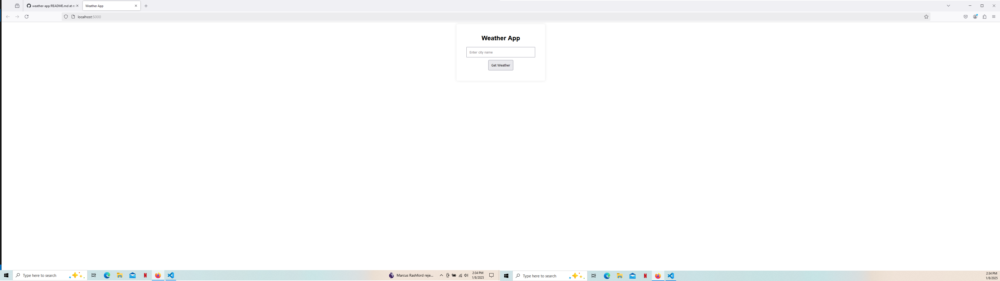
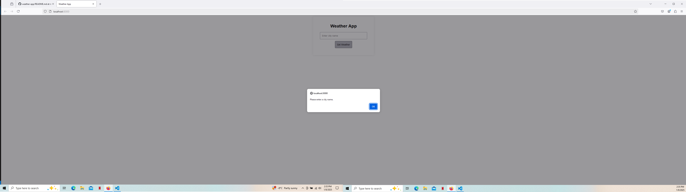
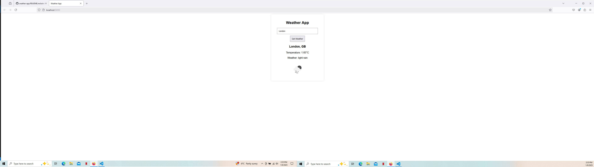

# 📌 Weather App

A simple weather app that fetches real-time weather data using the **OpenWeather API**. Built with **Node.js, Express.js, JavaScript, HTML, and CSS**, this app allows users to check the temperature and weather conditions of any city.

## 📸 Screenshot

## :rocket: Features
&nbsp;✅ Users can enter a city name to get **real-time weather data**.  
✅ Displays **temperature, weather conditions, and an icon**.  
✅ Uses the **OpenWeatherMap API** to fetch data.  
✅ **Responsive design** (mobile-friendly).  
✅ **Express.js backend** to handle API requests securely.   

## 🛠 Tech Stack
* **Frontend:** HTML, CSS, JavaScript  
* **Backend:** Node.js, Express.js  
* **API:** OpenWeatherMap API
* **Tools:** Fetch API (AJAX), Nodemon, Axios  

